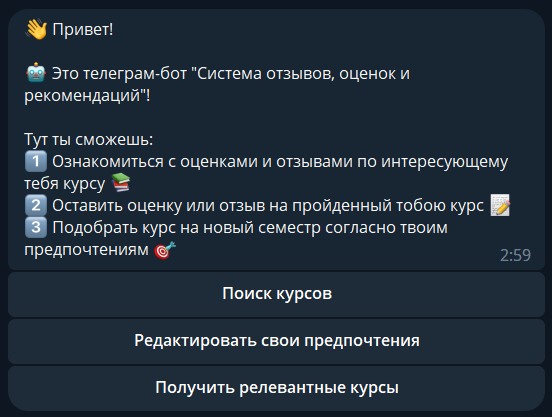

# Course feedback ranking system
Collecting feedback on university courses and ranking by preference


> @spbu_feedback_bot

> It was created on the basis of SPbU University, Faculty of Mathematics and Computer Science 

## Launching the application

To launch the application, you need to execute the command

```bash
docker-compose up --build
```

Сервер слушает на порту 5000. 

## About the product
> [The full presentation](https://github.com/Pricolno/feedback-system/tree/bot/doc/feedback-system.pdf)

### Independent Microservices

* Database
* Recommendation systems
* Async telegram bot


### Bot interface

Main menu


Search for a course by title


Action with the course


Student feedback


Course feedback


Course Metrics


Tag Search


View tags


Getting relevant courses


### How do we get the tags?

 Tags are generated from the course text description

* Automatically download course descriptions
* How to generate tags from text?
    * ChatGPT
    * PLSA
    * Different neural networks
* Normalization

### Database architecture


### Scenario of bot operation

> without rate sistem


> with rate sistem


### Future

* Improve tag selection and normalization
* User authorization system
* Support for courses in other departments

---

> https://t.me/spbu_feedback_bot
